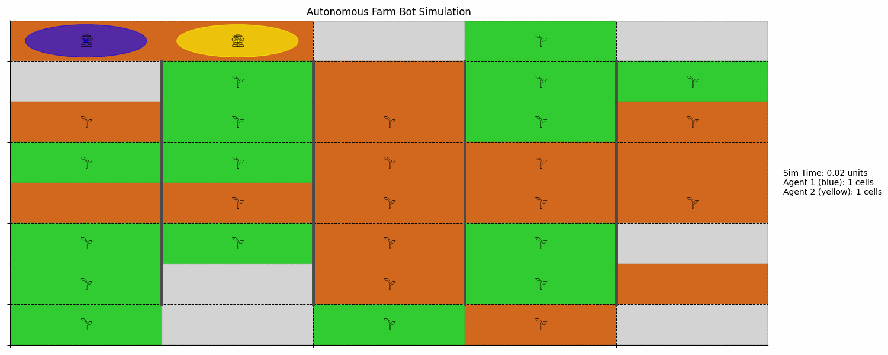
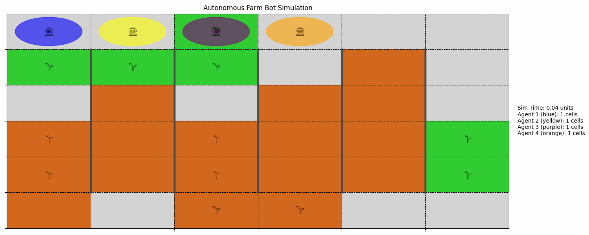

# MultiAgentAgriCoverage

This repository contains the simulation framework and analysis code for:  
**"Multi-Agent Coverage for Agricultural Robotics-Based Soil and Crops Monitoring"**  
Designed and implemented by [Bhaavin Jogeshwar](mailto:bj83@students.uwf.edu)

## Project Overview

This simulation demonstrates decentralized behavior planning for multi-agent robotic systems performing planting and watering tasks in a constrained farm grid. It features:

- **Local perception and decision-making**
- **Dynamic helper logic for idle agents**
- **A\* path planning to reroute agents around blocked paths**
- **Preassigned vs. Local planner comparisons**
- **Agent freezing and fault tolerance analysis**

---

## Visual Demonstrations

This section presents key simulation behaviors from our multi-agent farm coverage system using animated GIFs. These visuals demonstrate planner logic, fault tolerance, and system scalability.

---

### Planner Behavior Comparison

| **Local Planner (LP)** | **Preassigned Column Planner (PCP)** |
|------------------------|--------------------------------------|
|  |  |
| Agents dynamically choose unexplored columns, reroute, and assist others once done. | Agents follow fixed column assignments, offering structure but reduced flexibility. |

---

### Agent Failure and Recovery

| **1 Agent Breakdown in LP** | **1 Agent Breakdown in PCP** |
|-----------------------------|-------------------------------|
|  |  |
| Idle agents detect failure and cover abandoned areas. | Remaining agents stick to their own zones, missing failed agent’s area. |

---

### Scalability Analysis (LP)

| **1 Agent** | **2 Agents** | **4 Agents** | **7 Agents** |
|-------------|--------------|--------------|--------------|
|  |  |  |  |

---

### Spatial Distribution Start – LP

| **3 Agents from Separate Start Zones** |
|----------------------------------------|
|  |
| Demonstrates LP’s ability to adapt to spatially distributed deployment scenarios. |

---

>  _All demos run on a 15x7 farm grid with varied initial conditions and planner configurations._

## Quick Start

### 1. Clone this repository
```bash
git clone https://github.com/sevilresearch/MultiAgentAgriCoverage.git
cd MultiAgentAgriCoverage
```

### 2. Install Emoji Font for Icons

To enable emoji-like visuals in simulation icons, install the Twitter Color Emoji SVG font:

🔗 [Download Twemoji TTF](https://sourceforge.net/projects/twitt-c-emoji-svg-font.mirror/)

Once downloaded, install the TTF file based on your operating system:
- **Windows**: Right-click the `.ttf` file → Install
- **Mac**: Double-click the `.ttf` file → Install Font
- **Linux**: Copy the `.ttf` to `~/.fonts/` and run `fc-cache -fv`

---

## Run the Simulation

```bash
python main.py
```

---

## Project Structure

```
core simulation files:
├── main.py                  # Entry point – run simulations
├── agent.py                 # Agent class with movement, task logic, and rerouting
├── behavior_planning.py     # Three planner strategies: LP, PCP, and Block-based
├── grid.py                  # Grid logic with cell types and environment boundaries
├── state_estimation.py      # Perception logic for task identification
├── visualization.py         # Frame-based visual simulation and logging
├── generatinggrid.py        # (Optional) Generate or edit grid layouts

analysis & results:
├── project3analysis.py      # Script for post-run analysis and plotting
├── IMECE_LP_20grids.txt     # Simulation log files
├── IMECE_PCP_20grids.txt
├── *.eps, *.png, *.psd      # Figures for paper and visualizations

assets:
├── images/                  # Contains all plot snapshots and debug visuals
├── rerouting/               # Diagrams of reroute behavior
├── startposdiff/            # Grid variations and experiments

others:
├── __pycache__/             # Python cache files
```

---
