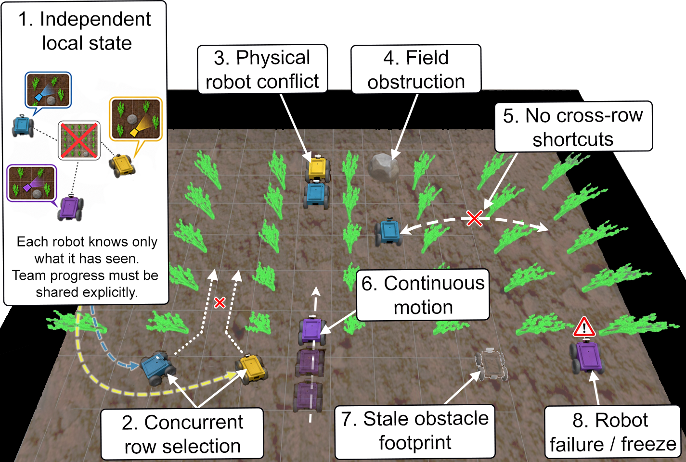
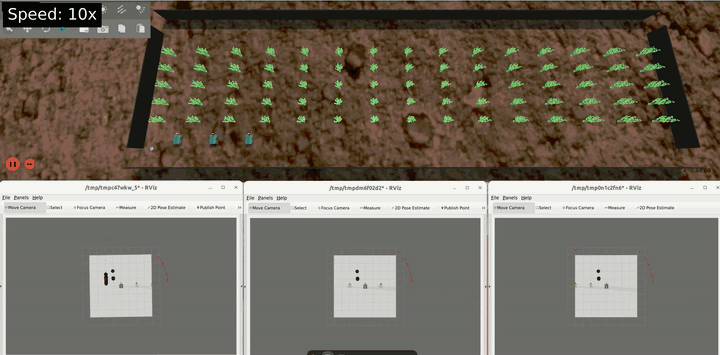
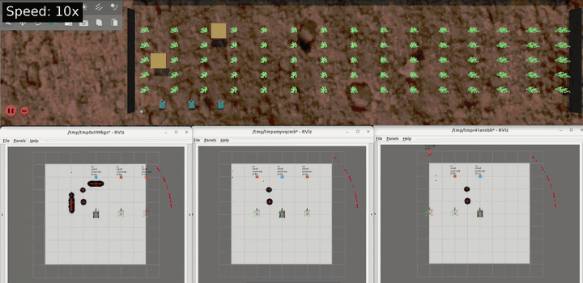
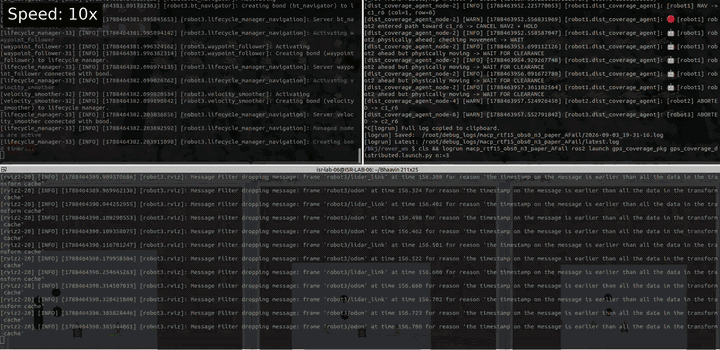
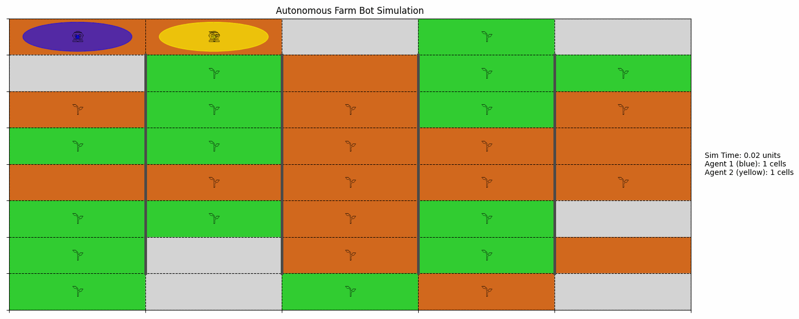
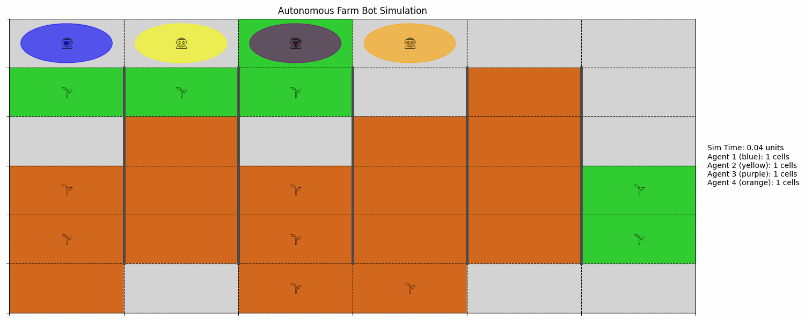

# MultiAgentAgriCoverage

This repository contains the simulation framework and analysis code for:  
**"Multi-Agent Coverage for Agricultural Robotics-Based Soil and Crops Monitoring"**  
Designed and implemented by [Bhaavin Kishore Jogeshwar](mailto:bj83@students.uwf.edu)


## ROS 2 Multi-Robot Extension

The original **Multi-Agent Coverage Planning (MACP)** framework in this repository was developed using a discrete agricultural grid representation. In subsequent work, MACP was extended toward robotic execution using three independently operating ROS 2-based simulated rovers, each running its own Nav2 navigation stack.

This robotic implementation is presented in:

**"Toward Deployable Multi-Agent Coverage Planning through Physics-Based Simulation for Agricultural Robotics"**

The extension preserves the original MACP coverage strategy with decentralized row selection, helper behavior, rerouting, and recovery of unfinished work, while addressing coordination and navigation challenges that arise when independently operating robots execute the algorithm in a physics-based environment.

### Challenges Introduced by Robotic Execution

The original discrete MACP formulation assumes simplified agent motion and state updates. When the agents are replaced by independently navigating rovers, several additional execution challenges arise.



**Fig. 1b — Challenges introduced by independently navigating rovers.**

These include:

1. **Independent local state** — each rover maintains its own local information and receives team progress through shared messages.
2. **Concurrent row selection** — multiple rovers can make coverage decisions simultaneously.
3. **Physical robot conflict** — rovers can block one another while navigating.
4. **Field obstruction** — obstacles may prevent traversal of part of a crop row.
5. **No cross-row shortcuts** — transitions between crop rows must occur through the headlands to avoid crossing plants.
6. **Continuous motion** — robots physically navigate between GPS-defined waypoints rather than moving instantaneously between grid cells.
7. **Stale obstacle footprint** — another rover may temporarily remain represented as an obstacle after leaving an area.
8. **Robot failure / freeze** — unfinished work must be released and recovered when a rover becomes unavailable.

### Mechanisms Added for Robotic Execution

To address the challenges above, the ROS 2 implementation introduces the following mechanisms:

| Mechanism | Purpose |
| --- | --- |
| **Distributed state exchange** | Shares visited waypoints, row claims, and rover status among independently operating robots. |
| **Row claim & ownership** | Prevents multiple rovers from simultaneously committing to the same crop row while allowing unfinished work to be recovered. |
| **Goal revalidation** | Cancels or replans goals that become obsolete as the shared mission state changes. |
| **Headland-constrained routing** | Restricts transitions between crop rows to the open headlands rather than allowing cross-row shortcuts. |
| **Robot right-of-way** | Resolves temporary conflicts when two rovers attempt to occupy or traverse the same region. |
| **Robot vs. obstacle handling** | Distinguishes temporary blockage caused by another rover from an environmental obstruction. |
| **Obstacle recovery** | Retreats from an obstructed row, defers the assignment, retries from the opposite side, and isolates only the unreachable portion when necessary. |
| **Failure-triggered work release** | Releases unfinished coverage after a failed rover's row claim expires so another rover can complete the work. |

These mechanisms provide the transition from the original grid-based MACP formulation to independently navigating multi-robot execution in ROS 2.

---

## Three-Rover Physics-Based Simulations

The ROS 2 implementation was evaluated using **three independently operating rovers**, **14 traversable crop rows**, and **98 GPS-defined mission waypoints**.

Three scenarios were evaluated.

### 1. Nominal Operation



[View simulation video](ROS2_Videos/Nominal_operation.mp4)

Three rovers perform coordinated coverage under nominal conditions. The simulation demonstrates distributed row selection, robot-conflict resolution, and helper behavior for completing remaining coverage.

**Result:** 98/98 mission waypoints visited.

---

### 2. Two Static In-Row Obstacles



[View simulation video](ROS2_Videos/Two_static_obstacles.mp4)

Two static obstacles are introduced within crop rows. When a rover detects an obstruction, it retreats from the row and defers the remaining assignment. The row can later be approached from the opposite headland so that reachable waypoints remain covered.

**Result:** 96 waypoints visited + 2 waypoints classified as unreachable.

---

### 3. Mid-Row Rover Failure



[View simulation video](ROS2_Videos/Rover_failure.mp4)

One rover is intentionally stopped while operating inside a crop row. Its active row claim expires after the failure, releasing the unfinished assignment for the remaining robots. The other rovers then continue coverage and recover the interrupted work.

**Result:** 98/98 mission waypoints visited.

---

## Simulation Summary

| Scenario | Coverage Outcome | Demonstrated Response |
| --- | --- | --- |
| **Nominal** | 98/98 visited | Row conflicts resolved and helper rover completes remaining coverage |
| **Two in-row obstacles** | 96 visited + 2 unreachable | Opposite-side re-entry recovers all reachable waypoints |
| **Rover failure** | 98/98 visited | Failed rover's work is released and completed by teammates |

These simulations demonstrate the progression of MACP from a discrete multi-agent coverage framework toward execution by independently navigating agricultural rovers.


## Project Overview

This simulation demonstrates decentralized behavior planning for multi-agent robotic systems performing planting and watering tasks in a constrained farm grid. It features:

- **Local perception and decision-making**
- **Dynamic helper logic for idle agents**
- **A\* path planning to reroute agents around blocked paths**
- **Preassigned vs. Local planner comparisons**
- **Agent freezing and fault tolerance analysis**

---

## Visual Demonstrations

This section presents key simulation behaviors from our multi-agent farm coverage system using animated GIFs. These visuals demonstrate planner logic, fault tolerance, and system scalability.

---

### Planner Behavior Comparison

| **Local Planner (LP)** | **Preassigned Column Planner (PCP)** |
|------------------------|--------------------------------------|
|  |  |
| Agents dynamically choose unexplored columns, reroute, and assist others once done. | Agents follow fixed column assignments, offering structure but reduced flexibility. |

---

### Agent Failure and Recovery

| **1 Agent Breakdown in LP** |
|-----------------------------|
|  |
| Idle agents detect failure and cover abandoned areas. |

---

### Scalability Analysis (LP)

| **1 Agent** | **2 Agents** |
|-------------|--------------|
|  |  |

| **4 Agents** | **7 Agents** |
|--------------|--------------|
|  |  |

---

### Spatial Distribution Start – LP

| **3 Agents from Separate Start Zones** |
|----------------------------------------|
|  |
| Demonstrates LP’s ability to adapt to spatially distributed deployment scenarios. |

---

## Quick Start

### 1. Clone this repository
```bash
git clone https://github.com/sevilresearch/MultiAgentAgriCoverage.git
cd MultiAgentAgriCoverage
```

### 2. Install Emoji Font for Icons

To enable emoji-like visuals in simulation icons, install the Twitter Color Emoji SVG font:

🔗 [Download Twemoji TTF](https://sourceforge.net/projects/twitt-c-emoji-svg-font.mirror/)

Once downloaded, install the TTF file based on your operating system:
- **Windows**: Right-click the `.ttf` file → Install
- **Mac**: Double-click the `.ttf` file → Install Font
- **Linux**: Copy the `.ttf` to `~/.fonts/` and run `fc-cache -fv`

---

## Run the Simulation

```bash
python main.py
```

---

## Project Structure

```
core simulation files:
├── main.py                  # Entry point – run simulations
├── agent.py                 # Agent class with movement, task logic, and rerouting
├── behavior_planning.py     # Three planner strategies: LP, PCP, and Block-based
├── grid.py                  # Grid logic with cell types and environment boundaries
├── state_estimation.py      # Perception logic for task identification
├── visualization.py         # Frame-based visual simulation and logging
├── generatinggrid.py        # (Optional) Generate or edit grid layouts

analysis & results:
├── project3analysis.py      # Script for post-run analysis and plotting
├── IMECE_LP_20grids.txt     # Simulation log files
├── IMECE_PCP_20grids.txt
├── *.eps, *.png, *.psd      # Figures for paper and visualizations

assets:
├── images/                  # Contains all plot snapshots and debug visuals
├── rerouting/               # Diagrams of reroute behavior
├── startposdiff/            # Grid variations and experiments

others:
├── __pycache__/             # Python cache files
```

---
